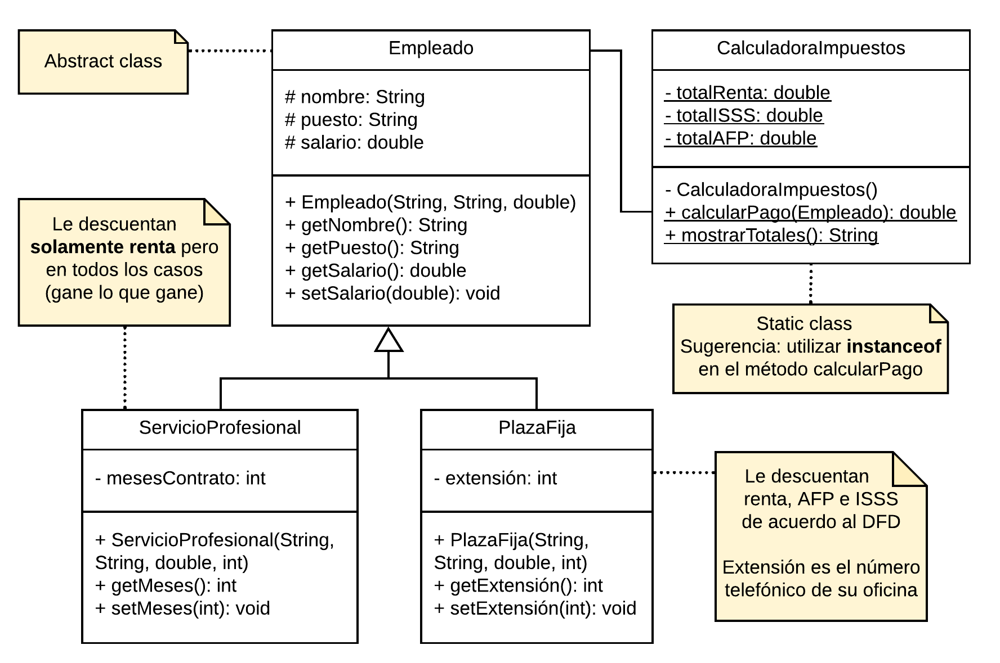
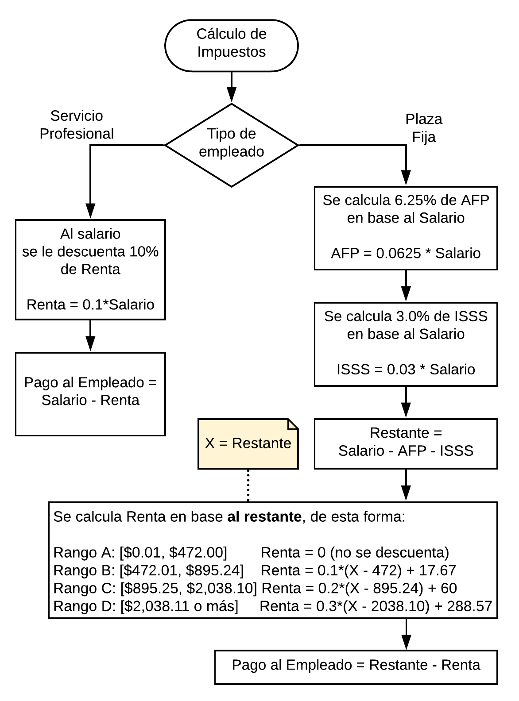

### Enunciado

Se solicita, que a partir del siguiente diagrama UML, realice lo siguiente:

* En el Main, cree dos objetos, uno de tipo ServicioProfesional y otro de tipo PlazaFija.
* Para ambos objetos, calcule el pago respectivo y muestre los totales.

**Nota: en la clase estática, los atributos de los totales son acumuladores de los descuentos que se le realizan a cada empleado. Y calcular sueldo se refiere al sueldo liquido, es decir, salario base - descuentos. Descuentos segun [DFD](#diagrama-de-descuentos).**

#### Diagrama de descuentos
